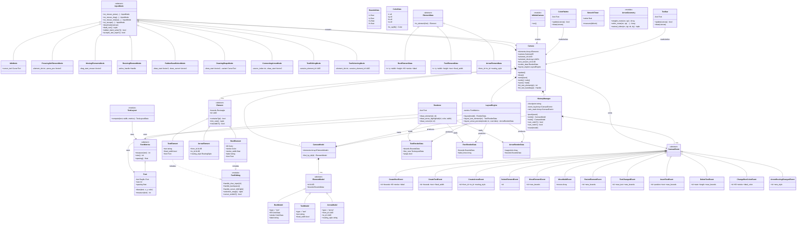

# Class Diagram

```mermaid
classDiagram
    %% ── Abstract bases ──────────────────────────────────────────────────

    class FontMetrics {
        <<abstract>>
        +measure(text) int
        +size() int
        +spacing() float
    }
    class Font {
        -font Raylib::Font
        +size int
        +spacing float
        +draw(text, x, y, color)
        +measure(text) int
    }
    FontMetrics <|-- Font

    class Element {
        <<abstract>>
        +bounds Rectangle
        +id UUID
        +contains?(pt) bool
        +min_size() tuple
        +resizable?() bool
    }
    class RectElement {
        +fill Color
        +stroke Color
        +stroke_width float
        +label string
        +font Font
    }
    class TextElement {
        +text string
        +fixed_width bool
        +font Font
    }
    class ArrowElement {
        +from_id UUID
        +to_id UUID
        +routing_style RoutingStyle
    }
    Element <|-- RectElement
    Element <|-- TextElement
    Element <|-- ArrowElement

    class TextEditing {
        <<module>>
        +handle_char_input(ch)
        +handle_backspace()
        +handle_cursor_left/right()
        +selection_range() tuple
        +cursor_visible?() bool
    }
    RectElement ..|> TextEditing : includes
    TextElement ..|> TextEditing : includes

    class ElementModel {
        <<abstract>>
        +id UUID
        +bounds BoundsData
    }
    class RectModel {
        +type = "rect"
        +fill ColorData
        +stroke ColorData
        +label string
    }
    class TextModel {
        +type = "text"
        +text string
        +fixed_width bool
    }
    class ArrowModel {
        +type = "arrow"
        +from_id UUID
        +to_id UUID
        +routing_style string
    }
    ElementModel <|-- RectModel
    ElementModel <|-- TextModel
    ElementModel <|-- ArrowModel

    class CanvasModel {
        +elements Array~ElementModel~
        +find_by_id(id) ElementModel
    }
    CanvasModel "1" *-- "many" ElementModel

    class CanvasEvent {
        <<abstract>>
    }
    class CreateRectEvent { +id +bounds +fill +stroke +label }
    class CreateTextEvent { +id +bounds +text +fixed_width }
    class CreateArrowEvent { +id +from_id +to_id +routing_style }
    class DeleteElementEvent { +id }
    class MoveElementEvent { +id +new_bounds }
    class MoveMultiEvent { +moves Array }
    class ResizeElementEvent { +id +new_bounds }
    class TextChangedEvent { +id +new_text +new_bounds }
    class InsertTextEvent { +id +position +text +new_bounds }
    class DeleteTextEvent { +id +start +length +new_bounds }
    class ChangeRectColorEvent { +id +fill +stroke +label_color }
    class ArrowRoutingChangedEvent { +id +new_style }
    CanvasEvent <|-- CreateRectEvent
    CanvasEvent <|-- CreateTextEvent
    CanvasEvent <|-- CreateArrowEvent
    CanvasEvent <|-- DeleteElementEvent
    CanvasEvent <|-- MoveElementEvent
    CanvasEvent <|-- MoveMultiEvent
    CanvasEvent <|-- ResizeElementEvent
    CanvasEvent <|-- TextChangedEvent
    CanvasEvent <|-- InsertTextEvent
    CanvasEvent <|-- DeleteTextEvent
    CanvasEvent <|-- ChangeRectColorEvent
    CanvasEvent <|-- ArrowRoutingChangedEvent

    class InputMode {
        <<abstract>>
        +on_mouse_press(...) InputMode
        +on_mouse_drag(...) InputMode
        +on_mouse_release(...) InputMode
        +on_escape(...) InputMode
        +deactivate(canvas)
        +draft_rect() tuple
        +rubber_band_select?() bool
        +accepts_text_input?() bool
    }
    class IdleMode { +cursor_tool CursorTool }
    class PressingOnElementMode { -element_idx int; -press_pos Vector2 }
    class MovingElementsMode { -drag_start_mouse Vector2 }
    class ResizingElementMode { -active_handle Handle }
    class RubberBandSelectMode { -draw_start Vector2; -draw_current Vector2 }
    class DrawingShapeMode { -draw_start Vector2; -variant CursorTool }
    class ConnectingArrowMode { -source_index int; -draw_start Vector2 }
    class TextEditingMode { -session_element_id UUID }
    class TextSelectingMode { -element_idx int; -session_element_id UUID }
    InputMode <|-- IdleMode
    InputMode <|-- PressingOnElementMode
    InputMode <|-- MovingElementsMode
    InputMode <|-- ResizingElementMode
    InputMode <|-- RubberBandSelectMode
    InputMode <|-- DrawingShapeMode
    InputMode <|-- ConnectingArrowMode
    InputMode <|-- TextEditingMode
    InputMode <|-- TextSelectingMode

    %% ── Data structs ─────────────────────────────────────────────────────

    class BoundsData {
        +x float
        +y float
        +w float
        +h float
    }
    class ColorData {
        +r u8
        +g u8
        +b u8
        +a u8
        +to_raylib() Color
    }
    class TextRenderData {
        +bounds BoundsData
        +line_runs TextLayoutData
        +wraps bool
    }
    class RectRenderData {
        +bounds BoundsData
        +label_lines Array
    }
    class ArrowRenderData {
        +waypoints Array
        +bounds BoundsData
    }

    %% ── Legacy persistence structs ───────────────────────────────────────

    class ElementData {
        <<abstract>>
        +to_element(font) Element
    }
    class RectElementData { +x +y +width +height +fill +stroke +label }
    class TextElementData { +x +y +width +height +text +fixed_width }
    class ArrowElementData { +from_id +to_id +routing_style }
    ElementData <|-- RectElementData
    ElementData <|-- TextElementData
    ElementData <|-- ArrowElementData

    %% ── Core engine classes ──────────────────────────────────────────────

    class HistoryManager {
        -checkpoint string
        -event_log Array~CanvasEvent~
        -redo_stack Array~CanvasEvent~
        +push(event)
        +undo() CanvasModel
        +redo() CanvasModel
        +can_undo?() bool
        +can_redo?() bool
        +reset(model)
    }
    HistoryManager "1" *-- "many" CanvasEvent
    HistoryManager --> CanvasModel : produces

    class LayoutEngine {
        -metrics FontMetrics
        +layout(model) RenderData
        +layout_text_element(m) TextRenderData
        +layout_arrow_preview(model, m, overrides) ArrowRenderData
    }
    LayoutEngine --> FontMetrics : uses
    LayoutEngine --> CanvasModel : reads
    LayoutEngine --> TextRenderData : produces
    LayoutEngine --> ArrowRenderData : produces
    LayoutEngine --> RectRenderData : produces

    class Renderer {
        -font Font
        +draw_element(el, rd)
        +draw_arrow_highlighted(rd, color, width)
        +draw_cursor(el, rd)
    }
    Renderer --> Font : uses
    Renderer --> TextRenderData : reads
    Renderer --> RectRenderData : reads
    Renderer --> ArrowRenderData : reads

    class Canvas {
        +elements Array~Element~
        +camera Camera2D
        +selected_id UUID
        +selected_ids Array~UUID~
        +text_session_id UUID
        +render_data RenderData
        +layout_engine LayoutEngine
        +update()
        +draw()
        +emit(event)
        +undo() / redo()
        +save() / load()
        +hit_test_element(pt) int
        +hit_test_handles(pt) Handle
    }
    Canvas "1" *-- "many" Element
    Canvas "1" *-- "1" CanvasModel
    Canvas "1" *-- "1" HistoryManager
    Canvas "1" *-- "1" LayoutEngine
    Canvas "1" *-- "1" InputMode
    Canvas --> CanvasEvent : emits

    class Toolbar {
        -font Font
        +update(canvas) bool
        +draw(canvas)
    }
    class ColorPalette {
        -font Font
        +update(canvas) bool
        +draw(canvas)
    }
    Toolbar --> Canvas : reads/writes
    ColorPalette --> Canvas : reads/writes

    class SmoothTimer {
        +value float
        +measure(&block)
    }

    class ArrowGeometry {
        <<module>>
        +straight_route(src, tgt) Array
        +ortho_route(src, tgt, ...) Array
        +natural_sides(src, tgt, dx, dy) tuple
    }

    class TextLayout {
        <<module>>
        +compute(text, width, metrics) TextLayoutData
    }
    TextLayout --> FontMetrics : uses

    class InfiniteCanvas {
        <<module>>
        +run()
    }
    InfiniteCanvas --> Canvas : creates

    InputMode --> Canvas : mutates
```
